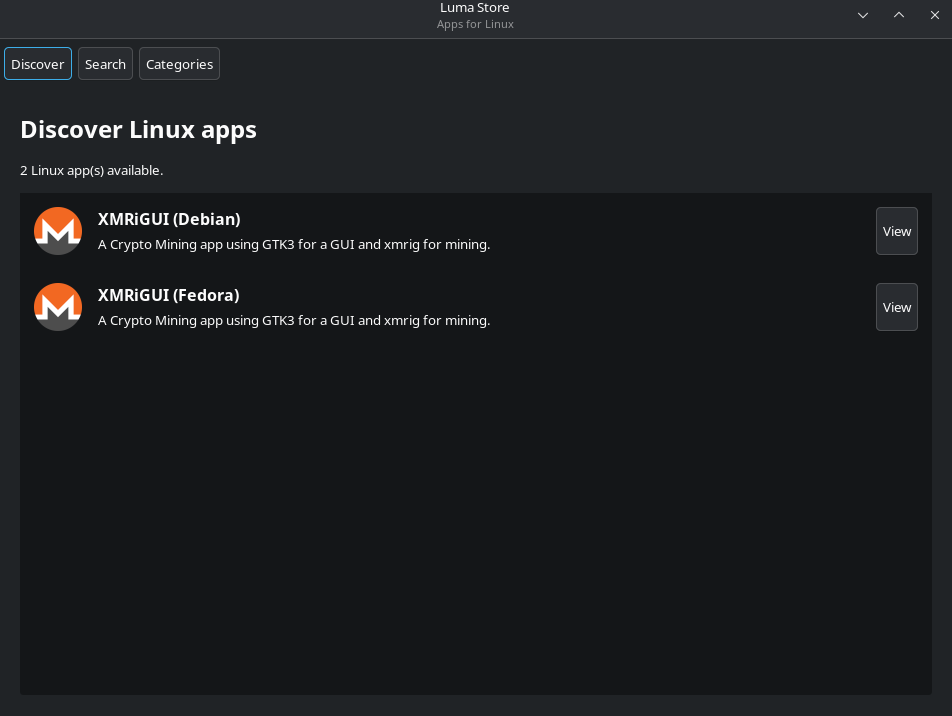

# Luma Store Linux

[](https://luma.free-time.me/discover/com.freetime.lumastore)

Luma Store Linux is a free and open-source desktop client store for the Luma Store API, tailored specifically for Linux systems. It provides a modern, high-performance user interface to easily browse, search, and manage native Linux applications.

Built with **Python 3** and **GTK 3**.



## Features

### Supported Formats
*   **DEB Packages:** Downloads Debian `.deb` packages directly to your system's `~/Downloads` folder and triggers your standard default package installer (e.g., Ubuntu Software, GDebi).
*   **RPM Packages:** Downloads Red Hat `.rpm` packages to `~/Downloads` and integrates seamlessly with your standard package management utility (e.g., Fedora Software, Discover).

### Key Capabilities
*   **Liquid Glass UI:** Native GTK 3 surfaces now use translucent glass panels, rounded controls, subtle borders, gradients and shadows throughout the store.
*   **Native Developer Dashboard:** The GTK dashboard now mirrors the web developer portal without embedding a WebView. It supports drafts, new submissions and updates for Android, Windows and Linux, multi-platform artifacts, optional per-platform repositories and store metadata, editing approved/rejected/change-requested submissions, delete/archive actions, status timelines, security scans, version history, review comments and developer notifications.
*   **Developer Analytics:** Native 7/30/90-day download analytics with app/platform filters, per-app and per-platform totals, daily activity and funding-link clicks.
*   **Developer Profile & Funding:** Edit the public developer profile and all developer-wide donation methods, including the same cryptocurrency/network wallet fields as the web dashboard.
*   **App Metadata Management:** Full native metadata editing includes categories, license, icon, descriptions, localized English metadata, screenshots, author links, source/repository information, Android package/versionCode, APK/EXE/MSI/DEB/RPM artifacts and platform-specific metadata.
*   **App Discovery & Search:** Instantly loads available software from the API feed and features a live search activation view.
*   **Dynamic Category Navigation:** Simple filtering using computed category indices directly from the server feed, with an interactive reset selector to view all applications.
*   **Rich Dynamic Information:** Renders application icons, descriptions, versions, file sizes, and automatically parses any additional structural keys provided by the API backend.
*   **Screenshots Showcase:** Embedded horizontal gallery view displaying app screenshots dynamically.
*   **Asynchronous Background Threads:** Avoids blocking or freezing the store's interface by offloading downloads and image assets processing onto isolated worker threads.

## Installation

### Linux

#### Debian / Ubuntu (APT)
1. Use the APT Repository setup:

```bash
sudo nano /etc/apt/sources.list.d/Freetime-Repo.list
```

then add:
```text
deb [trusted=yes arch=amd64] https://apt.fury.io/freetimemaker/ /
```

then run:
```bash
sudo apt update
sudo apt install store
```

#### Fedora / Red Hat (RPM)
1. Use the YUM Repository setup:

```bash
sudo nano /etc/yum.repos.d/freetime.repo
```

then add:
```text
[freetimemaker]
name=Freetime Repo
baseurl=https://yum.fury.io/freetimemaker/
enabled=1
gpgcheck=0
```

then run:
```bash
sudo dnf install store -y --refresh
```

## Native Developer Dashboard

The Developer Dashboard uses `supabase-py` with Supabase OAuth and PKCE. OAuth consent opens in the system browser and returns to the running GTK app through:

`http://127.0.0.1:8765/auth/callback`

That callback must be present in the Luma Store Supabase project's allowed redirect URLs. The `supabase-py` auth client persists and refreshes the session through a small file-backed storage adapter at `~/.config/luma-store/session.json` with user-only file permissions.

No WebView is used. The dashboard reads and writes the same Supabase data as the web portal. Drafts can be saved before the submission is complete. Final submissions and metadata updates require GitHub login because the Luma Store backend verifies repository ownership/write access using the GitHub provider token.

DEB and RPM build targets vendor the pinned `supabase-py` runtime into `/usr/lib/luma-store/vendor`, so installed packages do not depend on a separately installed system-wide `supabase` Python package.

The native dashboard also exposes the web portal's developer analytics, submission timelines, security/VirusTotal information, app version history, notifications, review comments and README download-badge copying.

## Makefile Commands

If you want to build Luma Store Linux from source, ensure you have the following packages installed:
* `python3`
* `gtk3`
* `pygobject`
* `python3-pip` (for source/package builds)
* `supabase==2.31.0`
<br>
<br>

Install locally:

`sudo make install`

or if you want to bundle a Debian package:

`make deb`

or for the Red Hat RPM package:

`make rpm`
<br>
<br>

## Contribute

### Development
Pull requests and bug reports are welcome on the repository.

---
**Disclaimer**: Installing applications handles code packages over remote integration. Always verify the source packages you install. Use at your own risk.
